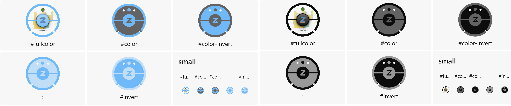
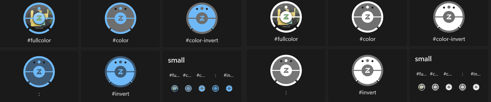
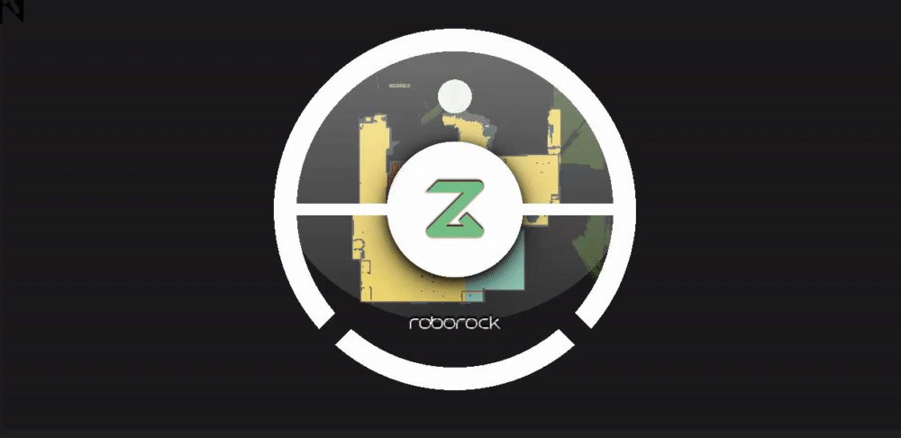

# Xiaomi Roborock SVG icon

 [)](https://github.com/home-assistant)  

 - for [hass-fontawesome](https://github.com/thomasloven/hass-fontawesome)
 - with optional **dynamic** [xiaomi_cloud_map_extractor](https://github.com/PiotrMachowski/Home-Assistant-custom-components-Xiaomi-Cloud-Map-Extractor) background image 

## Icon 

## Map background

1. Open **roborock.svg** and find `<image width="512" height="512" href="/local/map.png"/>`
2. Change the `href=""` value, it could be a local static image, from the web, or live camera image:
    - `/local/map.png`
    - `/api/camera_proxy/camera.xiaomi_cloud_map_extractor`
    - `https://brands.home-assistant.io/_/homeassistant/icon.png`

## Example

<table>
    <tr>
        <th>
            Light theme
        </th>
        <th>
            Dark theme
        </th>     
    </tr>       
    <tr>
        <td>
            
        </td>
        <td>
            
        </td>     
    </tr>   
    <tr>
        <th>
            Animated 💯
        </th>
        <td>
            
        </td>     
    </tr>       
</table>

***

[)](https://creativecommons.org/licenses/by-nc/4.0/) [&color=rgba(234,74,170,0.5) "for jsut 1 doolar you can lead a por man to fish")](https://github.com/sponsors/velijv) 

###### All product names, logos, and brands are property of their respective owners. All company, product and service names used are for identification purposes only. Use of these names, logos, and brands does not imply endorsement.
